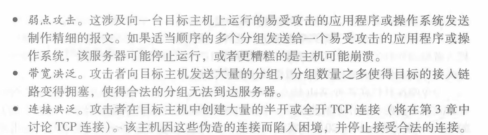
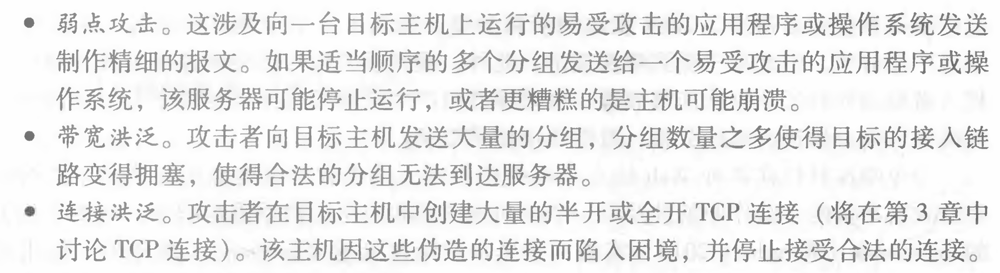
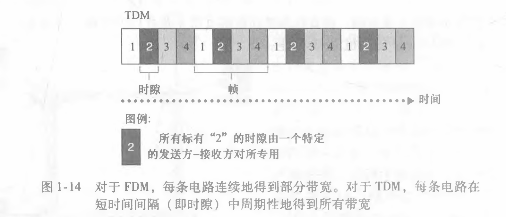
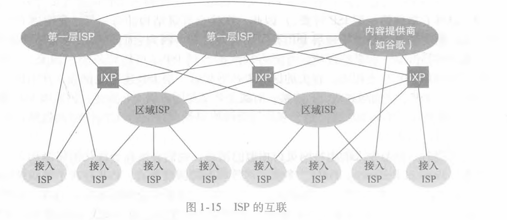
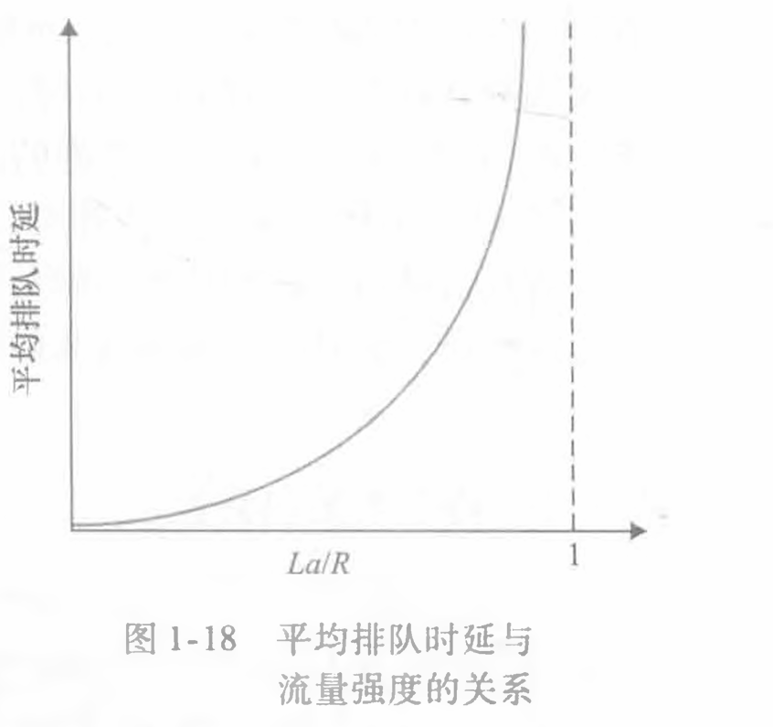

# 第一章 计算机网络和因特网

## 1.1 什么是因特网

- **1.1.1 具体构成描述**：介绍因特网的组成部分，主要包括终端系统、通信链路和分组交换机等。
- **1.1.2 服务描述**：因特网提供的服务，例如数据传输、应用层服务（如 Web 浏览、电子邮件等）。
  套接字接口：规定了运行
  在一个端系统上的程序请求因特网基础设施向运行在另一个端系统上的特定目的地程序交
  付数据的方式
- **1.1.3 什么是协议**：定义了在两个或多个通信实体之间交换的报文的格式和顺
  序，以及报文发送和/或接收一条报文或其他事件所采取的动作

## 1.2 网络边缘

- **1.2.1 接入网**: 1.端系统：通常把与因特网相连的计算机和其他设备称为端系统 2.数字用户线（Digital Subscriber Line,DSL）
- **1.2.2 物理媒体**：网络中使用的物理介质，如同轴电缆、光纤和无线电波，用于传输信号。

## 1.3 网络核心

- **1.3.1 分组交换**: 1.分组交换机利用存储转发传输，指在交换机能够开始向输岀链路传输该分组的第一个比特之前，必须接收到整个分组。 2.端到端时延： 3.转发表(forwarding table),用于将目的地址(或目的地址的一部分)映射成为输岀链路
- **1.3.2 电路交换**:传统的电路交换方式用于电话网络,每次通话占用一个专用电路。1.频分复用:对于一条 TDM 链路，时间被划分为固定期间的帧，并且每个帧又被划分为固定数量的时隙。
  传输速率计算：
  
- **1.3.3 网络的网络**：因特网是多个网络互联的集合，通过路由器等设备将不同的网络连接起来。
  

## 1.4 分组交换网中的时延、丢包和吞吐量

- **1.4.1 分组交换网中的时延概述**：讨论数据传输中的各种时延，如处理时延、排队时延等。
  
- **1.4.2 排队时延和丢包**：当网络拥塞时，数据包在路由器中排队等待传输，可能导致丢包。
  令 a 表示分组到达队列的平均速率,q 是传输速率，所有分组都是由 L 比特组成的,流量强度为 la/q,设计系统时流量强度不能大于 1。
  
- **1.4.3 端到端时延**：从源主机到目的主机的总时延。
- **1.4.4 计算机网络中的吞吐量**：网络的吞吐量是指单位时间内通过网络的有效数据量。分为瞬时吞吐量，平均吞吐量。吞吐量不仅取决于沿着路径的传输速率，而且取决于干
  扰流量。

## 1.5 协议层次及其服务模型

- **1.5.1 分层的体系结构**：网络协议通常按层次结构设计，每一层负责特定的功能，如应用层、传输层、网络层等。
- **1.5.2 封装**：数据在传输过程中经过不同的协议层，每层为数据添加头部信息，这个过程称为封装。

## 1.6 面对攻击的网络

- 讨论因特网面临的各种网络攻击类型，如 DoS 攻击、恶意软件攻击等，以及如何防范这些威胁。
